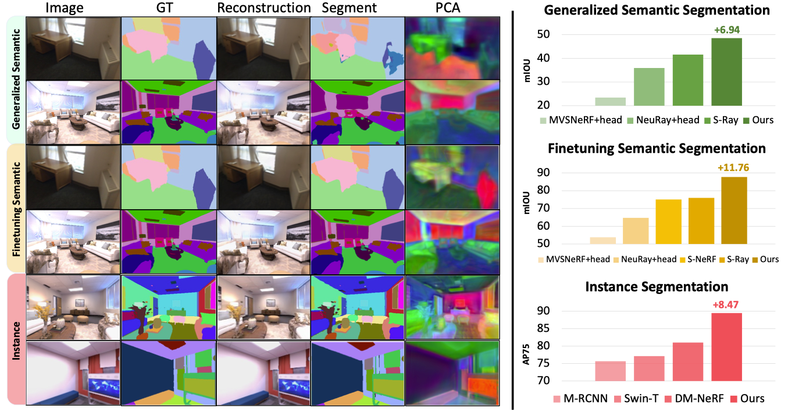

# GP-NeRF: Generalized Perception NeRF for Context-Aware 3D Scene Understanding [Official, CVPR 2024, Highlight]
[[Project]](https://lifuguan.github.io/gpnerf-pages/) [[Paper]](https://arxiv.org/abs/2311.11863)

## Overview
[Hao Li](https://lifuguan.github.io)<sup>1</sup>,&nbsp;
[Dingwen Zhang](https://zdw-nwpu.github.io/dingwenz.github.com/)<sup>1,6,*</sup>,&nbsp;
[Yalun Dai](https://jonbarron.info)<sup>4</sup>,&nbsp; 
[Nian Liu](https://scholar.google.com/citations?hl=en&user=ZSilWs4AAAAJ)<sup>2,*</sup>,&nbsp;
[Lechao Cheng](https://scholar.google.com/citations?user=PKFAv-cAAAAJ)<sup>3</sup>,&nbsp;
[Jingfeng Li](https://lifuguan.github.io)<sup>1</sup>,&nbsp;
[Jingdong Wang](https://jingdongwang2017.github.io)<sup>5</sup>,&nbsp;
[Junwei Han](https://scholar.google.ae/citations?user=xrqsoesAAAAJ)<sup>1,6</sup>

(<sup>1</sup>Brain and Artificial Intelligence Lab, Northwestern Polytechnical University <sup>2</sup>MBZUAI <sup>3</sup>Hefei University of Technology <sup>4</sup>Nanyang Technological Universityh <sup>5</sup>Baidu, Inc. <sup>6</sup>Institute of Artificial Intelligence, Hefei Comprehensive National Science Center \* Corresponding Author)

IEEE Conference on Computer Vision and Pattern Recognition (CVPR) 2024, **Highlight**



## Dataset Preparation
### **Scannet**
Please follows the [Semantic-Ray](https://github.com/liuff19/Semantic-Ray/) for Scannet data preperation.

```
├── data
│   ├── scannet
│   │   ├── scene0000_00
│   │   │   ├── color
│   │   │   │   ├── 0.jpg
│   │   │   │   ├── ...
│   │   │   ├── depth
│   │   │   │   ├── 0.png
│   │   │   │   ├── ...
│   │   │   ├── label-filt
│   │   │   │   ├── 0.png
│   │   │   │   ├── ...
│   │   │   ├── pose
│   │   │   │   ├── 0.txt
│   │   │   │   ├── ...
│   │   │   ├── intrinsic
│   │   │   │   ├── extrinsic_color.txt
│   │   │   │   ├── intrinsic_color.txt
│   │   │   │   ├── ...
│   │   │   ├── ...
│   │   ├── ...
│   │   ├── scannetv2-labels.combined.tsv
```
### Replica
Please follows the [Semantic-NeRF](https://github.com/Harry-Zhi/semantic_nerf) for Replica data preperation.
```
├── data
│   ├── Replica
│   │   ├── office_0
│   │   │   ├── Sequence_1
│   │   │   │   ├── depth
│   │   │   │   │   ├── depth_0.png
│   │   │   │   │   ├── ...
│   │   │   │   ├── rgb
│   │   │   │   │   ├── rgb_0.png
│   │   │   │   │   ├── ...
│   │   │   │   ├── semantic_class
│   │   │   │   │   ├── semantic_class_0.png
│   │   │   │   │   ├── ...
│   │   │   │   ├── traj_w_c.txt
│   │   │   ├── Sequence_2
│   │   │   │   ├── depth
│   │   │   │   │   ├── depth_0.png
│   │   │   │   │   ├── ...
│   │   │   │   ├── rgb
│   │   │   │   │   ├── rgb_0.png
│   │   │   │   │   ├── ...
│   │   │   │   ├── semantic_class
│   │   │   │   │   ├── semantic_class_0.png
│   │   │   │   │   ├── ...
│   │   │   │   ├── traj_w_c.txt
```

## Checkpoints
We provide our checkpoints in this [link](https://drive.google.com/drive/folders/18_FHE3-Hx_u3RV0K-8kzBP5xZGfgECQ3?usp=sharing) for evaluation.
### Loading Genearlized NeRF Pre-trained Model
For better and faster reconstruction results, you can leverage the pretrained model of GNT, which can be downloaded from [here](https://drive.google.com/file/d/1YvOJXa5eGpKgoMYcxC2ma7prB1n5UwRn/view).
Put the pretrained model in `out` and name it as `model_pretrain.pth`, then you can load it with the following command `--ckpt_path out/model_pretrain.pth`.

## Command
Note that we use 8 x NVIDIA A100 GPU to train our model.
### Evaluation
We provide VSCode `launch.json` to conduct evaluation procedure.

For Scannet Evaluation:
``` json
{
    "env":{
        "CUDA_VISIBLE_DEVICES": "2"
    },
    "name": "eval: semantic-scannet",
    "type": "python",
    "request": "launch",
    "program": "${workspaceFolder}/eval_gpnerf.py",
    "console": "integratedTerminal",
    "justMyCode": false,
    "args": ["--config", "configs/gnt_scannet.txt", "--expname", "debug", "--no_load_opt", "--ckpt_path", "path-to-ckpt", "--val_set_list","configs/scannetv2_test_split.txt"]
},
```
For Replica Evaluation:
```json
{
    "name": "eval: replica",
    "type": "python",
    "request": "launch",
    "program": "${workspaceFolder}/eval_gpnerf.py",
    "console": "integratedTerminal",
    "justMyCode": false,
    "args": ["--config", "configs/gnt_replica.txt", "--expname", "debug", "--no_load_opt", "--ckpt_path", "path-to-ckpt"]
},
```

### Training in Finetuning Setting
We recommand multi-gpu training to reproduce our results:
```bash 
python -m torch.distributed.launch --nproc_per_node=8 \
       --master_port=$(( RANDOM % 1000 + 50000 )) \
       ft_gpnerf.py --config configs/gnt_scannet_ft.txt \
       --ckpt_path path-to-ckpt --expname finetune_training_scannet --val_set_list configs/scannetv2_test_split.txt --no_load_opt --no_load_scheduler
```
We also provide `launch.json` command as below:
``` json
{
    "name": "ft: scannet",
    "type": "python",
    "request": "launch",
    "program": "${workspaceFolder}/ft_gpnerf.py",
    "console": "integratedTerminal",
    "justMyCode": false,
    "args": ["--config", "configs/gnt_scannet_ft.txt", "--expname", "debug", "--no_load_opt", "--ckpt_path", "path-to-ckpt"]
},
```

### Training in Finetuning Setting
We recommand multi-gpu training to reproduce our results:
```bash 
python -m torch.distributed.launch --nproc_per_node=8 \
       --master_port=$(( RANDOM % 1000 + 50000 )) \
       train_gpnerf.py --config configs/gnt_scannet.txt \
       --ckpt_path path-to-ckpt --expname generalized_training_scannet --val_set_list configs/scannetv2_test_split.txt --no_load_opt --no_load_scheduler
```
We also provide `launch.json` command as below:
``` json
{
    "env":{
        "CUDA_VISIBLE_DEVICES": "1"
    },
    "name": "train: scannet",
    "type": "python",
    "request": "launch",
    "program": "${workspaceFolder}/train_gpnerf.py",
    "console": "integratedTerminal",
    "justMyCode": false,
    "args": ["--config", "configs/gnt_scannet.txt", "--expname", "debug","--ckpt_path", "path-to-ckpt", "--no_load_opt", "--no_load_scheduler"]
},
```


## Acknowledgement
This repo is benefits from [GNT](https://github.com/VITA-Group/GNT). Thanks for their wonderful work.

